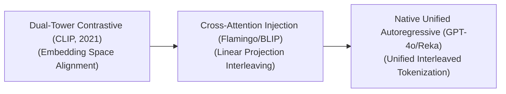

# Awesome-Vision-Language-Models
## Vision-Language Models (VLMs): Evolution, Variants, Types, & Applications

Vision-Language Models (VLMs) represent a cornerstone of multimodal artificial intelligence, bridging the gap between computer vision and natural language processing. Instead of treating text and images as isolated signals, VLMs operate on a shared semantic workspace, enabling machines to describe visual scenes, locate objects via textual commands, and execute complex reasoning over charts, documents, and video feeds.

---

## 1. The Chronological Evolution

The architectural progression of vision-language processing reflects a shift from detached, hand-crafted feature fusion to unified, single-tower transformers that ingest raw pixels alongside text characters natively.

| Era / Paradigm | Concept & Details | First Used (Year) | Key Paper |
| :--- | :--- | :--- | :--- |
| **The Dual-Tower Contrastive Alignment Era (~2021–2022)** | *Concept:* Popularized by OpenAI's **CLIP**. It pairs an independent Image Encoder (ViT/CNN) with a standalone Text Encoder (Transformer). The models are trained on billions of image-caption pairs using a contrastive loss function to pull matching semantic vectors close together in a shared vector space.  *Limitation:* Exceptional at zero-shot classification and text-to-image retrieval, but incapable of open-ended conversational reasoning or generating dense text descriptions. | 2021 | [CLIP (Radford et al., 2021)](https://arxiv.org/abs/2103.00020) |
| **The Modular Cross-Attention Injection Era (~2022–2024)** | *Concept:* Models like **Flamingo**, **BLIP-2**, and **LLaVA** combined pre-trained, frozen vision encoders with frozen Large Language Models. They introduced learnable bottleneck layers—such as Perceiver Resamplers or linear projection matrices—to transform visual feature vectors into virtual "image tokens" that the text model can ingest.  *Limitation:* Suffered from a structural information bottleneck, as the frozen vision and language architectures could not co-adapt natively. | 2022 | [Flamingo (Alayrac et al., 2022)](https://arxiv.org/abs/2204.14198) |
| **The Native Unified Autoregressive Era (~2024–Present)** | *Concept:* The modern state-of-the-art framework seen in models like **GPT-4o**, **Gemini 1.5**, and **Chameleon**. Images are directly split into structural patches (patchified), projected linearly, and interleaved seamlessly with text characters into a single, massive Transformer core, optimizing vision and text tokens simultaneously. | 2023 | [Fuyu-8B (Adept, 2023)](https://www.adept.ai/blog/fuyu-8b) |

---

## 2. Core Functional & Architectural Variants

Vision-Language Models are categorized based on their underlying token processing layouts and directional execution properties.

| VLM Variant | Mechanism & Examples | First Used (Year) | Key Paper |
| :--- | :--- | :--- | :--- |
| **Contrastive Alignment VLMs** | *Mechanism:* Maps separate sensory streams into a shared abstract grid, maximizing the dot-product similarity score of matched pairs while minimizing mismatched pairs.  *Examples:* CLIP, Align, and SigLIP. | 2021 | [CLIP (Radford et al., 2021)](https://arxiv.org/abs/2103.00020) |
| **Autoregressive Generative VLMs (Vision-Language LLMs)** | *Mechanism:* Ingests a mixture of text and image tokens and uses a causal attention mask to predict the exact next token in the sequence, allowing the model to produce long-form textual responses.  *Examples:* LLaVA, InternVL, and Qwen-VL. | 2022 | [Flamingo (Alayrac et al., 2022)](https://arxiv.org/abs/2204.14198) |
| **Masked Multi-Modal Autoencoders** | *Mechanism:* Hides text tokens or visual patches randomly across a multi-modal document, forcing the transformer backbone to exploit cross-modal context boundaries to reconstruct the missing information.  *Examples:* FLAVA and CoCa. | 2021 | [FLAVA (Singh et al., 2021)](https://arxiv.org/abs/2112.04482) |

---

## 3. Image Tokenization & Processing Modalities

Depending on how raw visual data is converted into tokens for the neural network, VLMs exploit distinct structural front-ends.

| Tokenization Modality | Mechanism, Pros, & Significance | First Used (Year) | Key Paper |
| :--- | :--- | :--- | :--- |
| **Dense Patch-Level Tokenization (ViT-Based)** | *Mechanism:* Flattens an image into non-overlapping grids of $16 \times 16$ or $14 \times 14$ pixel patches. Each patch is treated exactly like a "word token" inside the self-attention block.  *Pros:* Captures granular, high-frequency spatial features essential for reading small text or identifying micro-defects. | 2020 | [ViT (Dosovitskiy et al., 2020)](https://arxiv.org/abs/2010.11929) |
| **Region-Based Object Grounding (RoI-Based)** | *Mechanism:* Employs a secondary object-detection bounding pipeline (like a Faster R-CNN) to crop explicit regions of interest (RoIs) before converting them into feature representations.  *Pros:* Ideal for localization tasks, such as automated camera counting or spatial robotic navigation. | 2019 | [ViLBERT (Lu et al., 2019)](https://arxiv.org/abs/1908.02265) |
| **Dynamic Resolution Patching (AnyRes / Megapixel Splitting)** | *Mechanism:* Dynamically analyzes an incoming image's native resolution. It slices massive high-res images into multiple localized standard patches alongside a zoomed-out global thumbnail, processing them concurrently.  *Significance:* Prevents the model from blurring out critical details when reading complex blueprints, high-resolution maps, or multi-column documents. | 2023 | [Monkey (Li et al., 2023)](https://arxiv.org/abs/2311.06602) |

---

## 4. Production Engineering Challenges & Mitigations

Deploying vision-language infrastructure into scalable business environments introduces severe computing and token management penalties.

| Engineering Challenge | Bottleneck & Mitigation | First Used (Year) | Key Paper |
| :--- | :--- | :--- | :--- |
| **The Visual Token Explosion Problem** | *The Bottleneck:* An image processed through a standard Vision Transformer can instantly generate anywhere from 256 to over 1,000 hidden tokens. Processing a single multi-image PDF can quickly fill up the model's active context window and saturate KV cache VRAM.  *Mitigation:* Implementing **Token Compression Kernels** (like C-Abstractor or Q-Former) that use localized pooling or cross-attention matrices to compress 576 raw visual tokens down into a highly dense portfolio of 32 or 64 semantic anchor tokens before entering the LLM core. | 2023 | [BLIP-2 (Li et al., 2023)](https://arxiv.org/abs/2301.12597) |
| **The Hallucination Refusal Deficit** | *The Bottleneck:* Generative VLMs are highly susceptible to "object hallucination"—inventing or misidentifying elements in an image due to the language model's aggressive text-completion bias overriding the physical pixel inputs.  *Mitigation:* Injecting rigorous preference optimization algorithms like **SilP (Symmetric Image-Language Preference Optimization)** or **VLM-RLHF** to heavily penalize models that fail to match explicit visual coordinate boundaries during verification passes. | 2025 | [SymMPO (iLearn-Lab, 2025)](https://arxiv.org/abs/2506.11712) |

---

## 5. Frontier Real-World Applications

| Frontier Application | Application Details | First Used (Year) | Key Paper |
| :--- | :--- | :--- | :--- |
| **Automated Chart, Blueprint, & Document Auditing (GUI Agents)** | *Application:* Processes high-resolution enterprise PDF files, financial spreadsheet charts, and engineering schematics. VLMs parse spatial layouts, extraction-tabulate hidden values, and answer structural audit queries instantaneously. | 2022 | [ChartQA (Masry et al., 2022)](https://arxiv.org/abs/2203.10244) |
| **Real-Time Autonomous Robotic Control & Grounding** | *Application:* Drives manipulation and navigation loops. VLMs convert natural language human commands (e.g., `"Grab the cleaning solution from the third shelf"`) into explicit 2D coordinate bounding boxes or physical motor action trajectories. | 2022 | [RT-1 (Brohan et al., 2022)](https://arxiv.org/abs/2212.06817) |
| **Omni-Channel Intelligent Video Surveillance Analytics** | *Application:* Monitors security cameras or vehicle dashcam feeds continuously. Spatio-temporal VLMs analyze continuous frames, generating natural language situational summaries or flagging security hazards (such as industrial safety violations) automatically. | 2019 | [VideoBERT (Sun et al., 2019)](https://arxiv.org/abs/1904.01766) |

