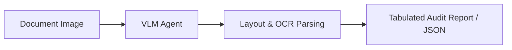

# Automated Chart, Blueprint, & Document Auditing (GUI Agents)

VLMs enable automated auditing and extraction from dense visual documents.

## Workflow
1. The user inputs a blueprint, flowchart, or chart image.
2. The VLM maps coordinates, parses spatial structural relationships, and transcribes visual annotations.
3. The VLM outputs structured answers or JSON tables.

## Key Benchmarks & Papers
* **ChartQA (Masry et al., 2022):** A benchmark for visual reasoning over charts. [ChartQA Paper](https://arxiv.org/abs/2203.10244)
* **Pix2Struct (Lee et al., 2023):** Pre-trained on web screenshot parsing. [Pix2Struct Paper](https://arxiv.org/abs/2210.03347)

[← Back to README](../README.md)
