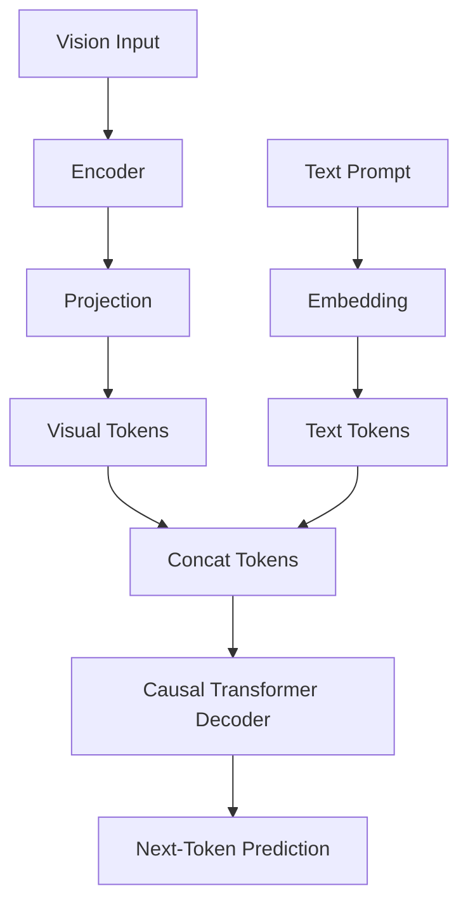

# Autoregressive Generative VLMs (Vision-Language LLMs)

Generative VLMs process visual prompt inputs and generate text sequences token-by-token using causal attention mechanisms.

## Architecture & Mechanism
These models project vision features into virtual token spaces. A decoder-only language model processes the concatenated visual and textual prompt tokens. A causal mask prevents tokens from attending to subsequent tokens during text generation.

## Key Models & Papers
* **LLaVA (Liu et al., 2023):** Popularized visual instruction tuning. [LLaVA Paper](https://arxiv.org/abs/2304.08485)
* **Qwen-VL (Bai et al., 2023):** Versatile multilingual and multimodal model. [Qwen-VL Paper](https://arxiv.org/abs/2308.12966)

## Applications
* Multimodal conversation and VQA.
* Image captioning and reasoning.
* Document understanding and OCR.

[← Back to README](../README.md)
