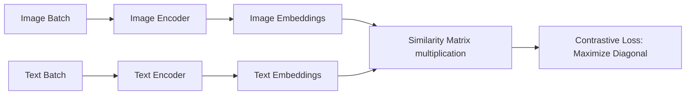

# Contrastive Alignment VLMs

Contrastive alignment models focus on mapping different modalities into a single, cohesive representation space.

## Architecture & Mechanism
Dual-tower encoders ingest paired media streams. The training objective is to push the cosine similarity of matching pairs to 1, while pushing mismatched pairs to 0.

## Key Models & Papers
* **CLIP (Radford et al., 2021):** Introduced zero-shot transfer capabilities. [CLIP Paper](https://arxiv.org/abs/2103.00020)
* **SigLIP (Zhai et al., 2023):** Replaced the softmax normalization in contrastive loss with a sigmoid pairwise loss. [SigLIP Paper](https://arxiv.org/abs/2303.15343)

## Applications
* Image tagging and classification.
* Text-to-image search and indexing.
* Initialization of visual encoders for generative VLMs.

[← Back to README](../README.md)
