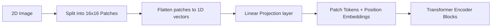

# Dense Patch-Level Tokenization (ViT-Based)

Dense patch-level tokenization flattens images into structured patch sequences that resemble word tokens.

## Architecture & Mechanism
1. An input image is divided into $N$ non-overlapping patches (typically $16 	imes 16$ or $14 	imes 14$ pixels).
2. Patches are flattened and projected into a linear embedding space.
3. Position embeddings are added to preserve spatial layout.
4. The sequence of patch embeddings is fed into standard Transformer encoders.

## Key Models & Papers
* **ViT (Dosovitskiy et al., 2020):** Proved that pure Transformers can achieve state-of-the-art results on image classification. [ViT Paper](https://arxiv.org/abs/2010.11929)

## Advantages
* Captures high-frequency spatial features.
* Eliminates the need for handcrafted convolutional architectures.

[← Back to README](../README.md)
