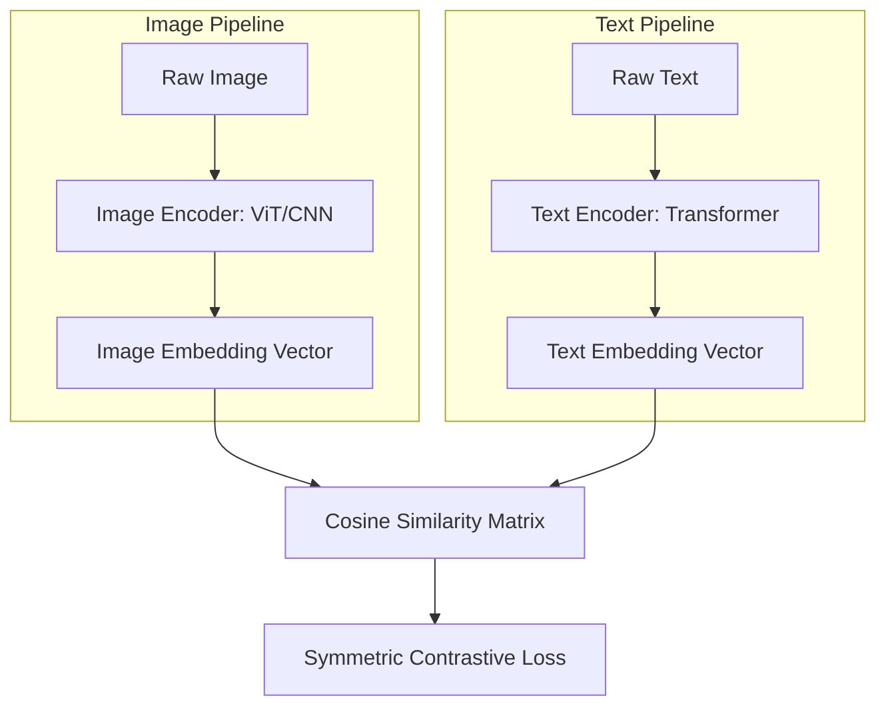

# The Dual-Tower Contrastive Alignment Era (~2021–2022)

The Dual-Tower Contrastive Alignment Era represents a key milestone in multimodal representation learning, where visual and textual modalities are projected into a shared embedding space.

## Architecture & Mechanism
This paradigm utilizes two independent encoders:
1. An **Image Encoder** (e.g., Vision Transformer or CNN) to extract visual features.
2. A **Text Encoder** (e.g., Transformer decoder/encoder) to extract textual features.

These embeddings are normalized and aligned via a symmetric contrastive loss (InfoNCE loss), which maximizes the similarity of matching image-caption pairs in a batch while minimizing the similarity of mismatched pairs.

## Key Models & Papers
* **CLIP (OpenAI, 2021):** Introduced contrastive pre-training on 400M web-scale image-text pairs. [CLIP Paper](https://arxiv.org/abs/2103.00020)
* **ALIGN (Google, 2021):** Scaled contrastive learning to 1.8B noisy image-text pairs. [ALIGN Paper](https://arxiv.org/abs/2102.05918)

## Advantages
* Excellent zero-shot classification and semantic search.
* Computationally efficient retrieval (embeddings can be pre-calculated).

## Limitations
* No autoregressive text generation capabilities.
* Incapable of complex reasoning, visual question answering (VQA), or localized object detection.

[← Back to README](../README.md)
