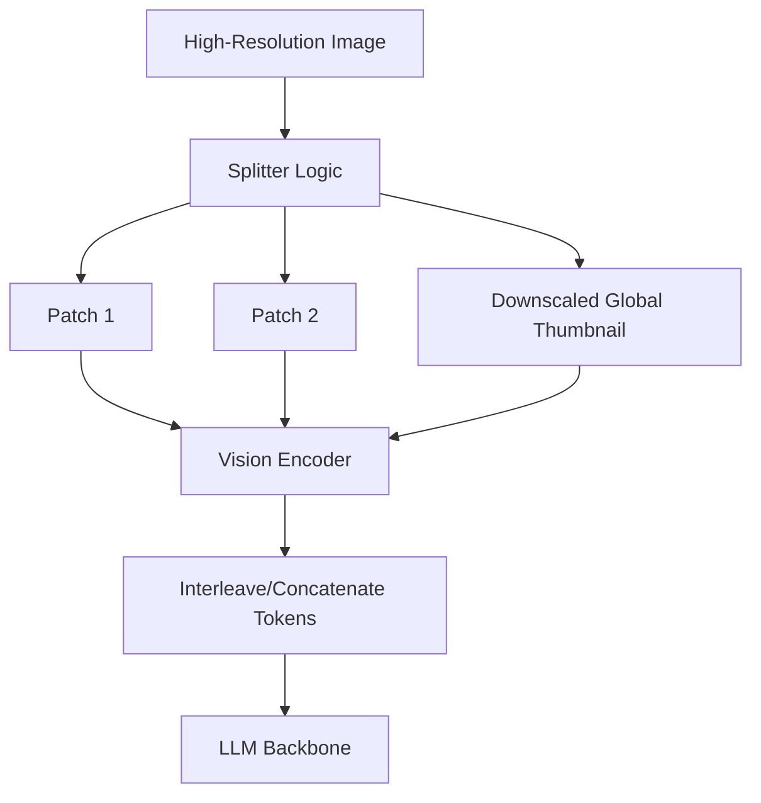

# Dynamic Resolution Patching (AnyRes / Megapixel Splitting)

Dynamic resolution patching resolves details in high-res images by dynamically slicing them into multiple sub-patches.

## Architecture & Mechanism
1. Ingests a high-resolution image.
2. Computes the optimal split grid (e.g., $2 	imes 2$ or $1 	imes 3$) depending on resolution.
3. Slices the image into standard-sized patches, alongside a downscaled global thumbnail.
4. Processes each patch independently and concatenates them for LLM ingestion.

## Key Models & Papers
* **Monkey (Li et al., 2023):** Slices images up to 896x1344 to support document and scene text understanding. [Monkey Paper](https://arxiv.org/abs/2311.06602)
* **LLaVA-NeXT (Liu et al., 2024):** Introduces AnyRes grid projection to handle complex high-resolution details. [LLaVA-NeXT Blog](https://llava-vl.github.io/blog/2024-01-30-llava-next/)

## Applications
* Reading dense multi-column PDFs and flowcharts.
* Medical image analysis.
* Detailed satellite map inspection.

[← Back to README](../README.md)
