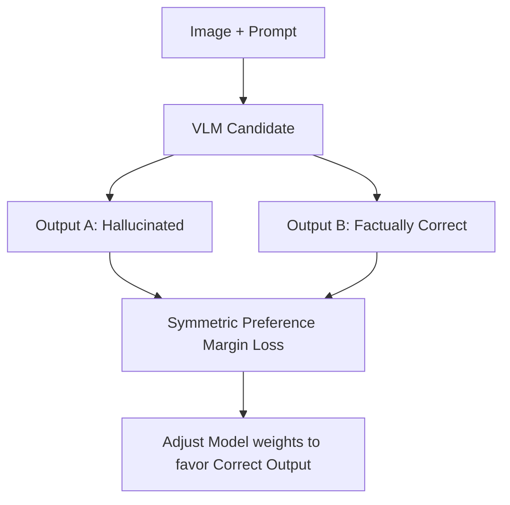

# The Hallucination Refusal Deficit

Generative VLMs frequently hallucinate text facts or misidentify spatial coordinates, often due to language model completion biases overriding actual visual data.

## Mitigation Strategies
* **Preference Optimization (RLHF / DPO):** Training models on preferred (accurate) and dispreferred (hallucinated) outputs.
* **Symmetric Multimodal Preference Optimization (SymMPO / SilP):** Enforces symmetric preference margins across visual triplets.

## Key Models & Papers
* **LLaVA-RLHF (Sun et al., 2023):** Aligned LLaVA outputs using reinforcement learning from human feedback. [LLaVA-RLHF Paper](https://arxiv.org/abs/2309.14320)
* **SymMPO / SilP (iLearn-Lab, 2025):** Mitigates hallucinations using theory-consistent symmetric multimodal preference optimization. [SymMPO Paper](https://arxiv.org/abs/2506.11712)

[← Back to README](../README.md)
