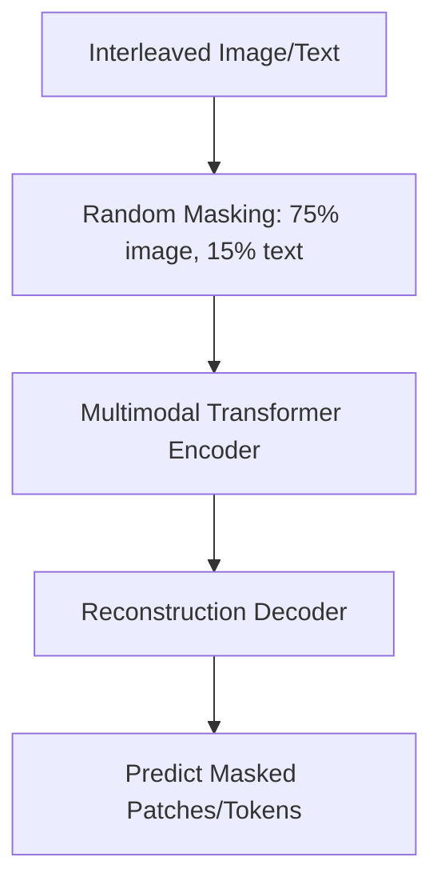

# Masked Multi-Modal Autoencoders

Masked autoencoders learn representations by reconstructing hidden portions of multi-modal inputs.

## Architecture & Mechanism
Parts of the text sequence or image patches are randomly masked. The model uses the remaining unmasked cross-modal context to predict the missing tokens or reconstruct pixels.

## Key Models & Papers
* **FLAVA (Singh et al., 2021):** A foundational model trained on both unimodal and multimodal objectives. [FLAVA Paper](https://arxiv.org/abs/2112.04482)
* **CoCa (Yu et al., 2022):** Combined contrastive loss and captioning loss in a single architecture. [CoCa Paper](https://arxiv.org/abs/2205.01917)

## Advantages
* Learns robust representations suitable for both classification and generation.
* Rich cross-modal understanding.

[← Back to README](../README.md)
