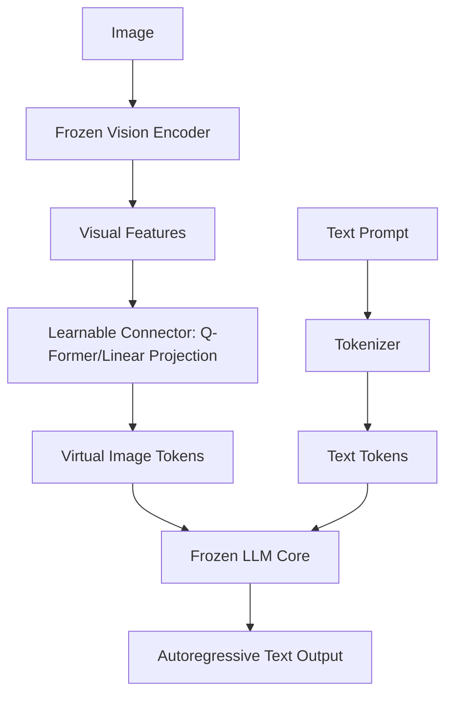

# The Modular Cross-Attention Injection Era (~2022–2024)

This era bridged the gap between vision and language by using learnable connection modules to interface pre-trained, frozen vision encoders with frozen Large Language Models (LLMs).

## Architecture & Mechanism
Instead of training a model from scratch, this paradigm connects:
1. A **Frozen Vision Encoder** (like ViT) to extract dense image features.
2. A **Connector/Bottleneck Layer** (such as a Perceiver Resampler or Q-Former) that maps high-dimensional visual features to virtual "image tokens".
3. A **Frozen LLM** that processes the virtual image tokens alongside text tokens.

## Key Models & Papers
* **Flamingo (DeepMind, 2022):** Introduced cross-attention layers to inject vision tokens into gated LLM blocks. [Flamingo Paper](https://arxiv.org/abs/2204.14198)
* **BLIP-2 (Salesforce, 2023):** Introduced the Q-Former to resolve visual-text representation gaps in two stages. [BLIP-2 Paper](https://arxiv.org/abs/2301.12597)
* **LLaVA (2023):** Used a simple linear projection layer to align CLIP features with the LLaMA embedding space. [LLaVA Paper](https://arxiv.org/abs/2304.08485)

## Advantages
* Leverages powerful pre-trained vision and language models, reducing compute costs.
* Enables open-ended conversational reasoning about visual data.

## Limitations
* Bottleneck in the connector layer limits fine-grained information transfer.
* The frozen visual and textual backbones cannot adapt to one another.

[← Back to README](../README.md)
