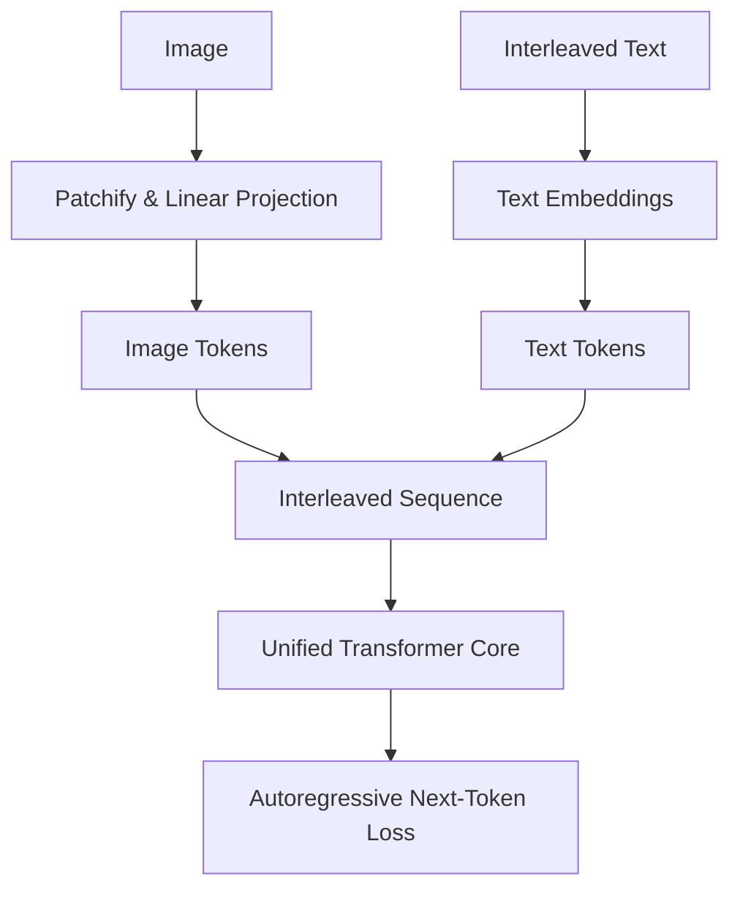

# The Native Unified Autoregressive Era (~2024–Present)

The state-of-the-art paradigm in VLM design treats images and text as equal citizens, training a unified transformer network natively on interleaved multi-modal data.

## Architecture & Mechanism
In this architecture, there is no separate connector or frozen LLM.
1. The image is split into spatial patches (patchified) and projected directly into the same vector dimension as text tokens.
2. A single, large Transformer core processes the interleaved sequence of image patches and text tokens.
3. Both modalities optimize using a causal autoregressive prediction target.

## Key Models & Papers
* **Fuyu-8B (Adept, 2023):** Removed the vision encoder entirely; patches feed directly into the projection layer. [Fuyu-8B Blog](https://www.adept.ai/blog/fuyu-8b)
* **Chameleon (Meta, 2024):** A family of early-fusion token-based mixed-modal models. [Chameleon Paper](https://arxiv.org/abs/2405.09818)
* **GPT-4o & Gemini 1.5:** Native multimodal models natively trained across audio, vision, and text.

## Advantages
* Eliminates modality alignment bottlenecks.
* Unified parameters co-adapt to visual and textual cues simultaneously.
* High spatial and contextual flexibility.

## Limitations
* Extremely high training compute requirements.
* Large context-window pressure due to the sheer number of raw patch tokens.

[← Back to README](../README.md)
