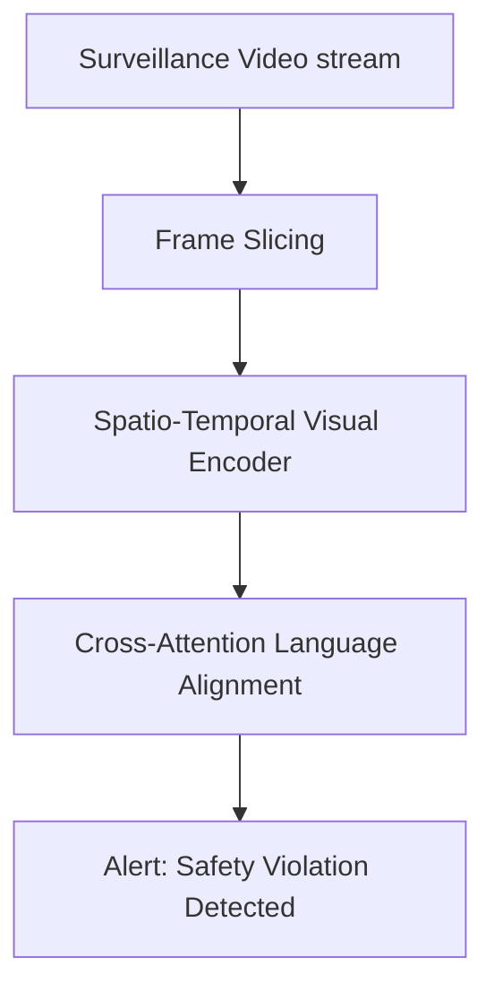

# Omni-Channel Intelligent Video Surveillance Analytics

Intelligent video analytics apply spatio-temporal VLM architectures to process sequential frame streams.

## Workflow
1. Surveillance video feeds are sliced into frame batches.
2. Frames are processed using spatial-temporal cross-attention layers.
3. The VLM outputs real-time alerts or event narratives.

## Key Models & Papers
* **VideoBERT (Sun et al., 2019):** Early effort in modeling sequence-to-sequence video actions. [VideoBERT Paper](https://arxiv.org/abs/1904.01766)
* **Video-LLaVA (Lin et al., 2023):** Learns joint representations over images and videos. [Video-LLaVA Paper](https://arxiv.org/abs/2311.10122)

[← Back to README](../README.md)
