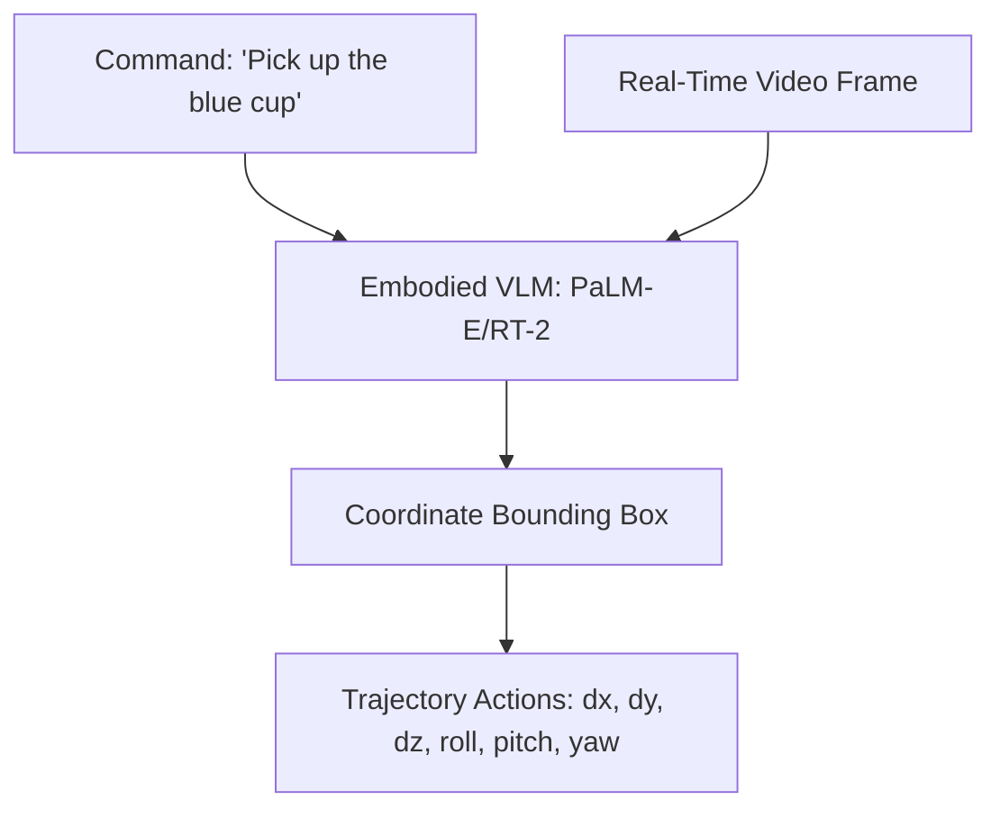

# Real-Time Autonomous Robotic Control & Grounding

Embodied VLMs bridge language instructions and robotic motor planning.

## Workflow
1. Multi-modal input receives natural language commands + camera feed.
2. The VLM determines spatial grounding (bounding box coordinates).
3. The network maps visual targets into discrete robotic end-effector trajectories or motor actions.

## Key Models & Papers
* **RT-1 (Brohan et al., 2022):** Open-source robotics transformer. [RT-1 Paper](https://arxiv.org/abs/2212.06817)
* **PaLM-E (Driess et al., 2023):** Employs language models directly to output robotic control signals. [PaLM-E Paper](https://arxiv.org/abs/2303.03378)

[← Back to README](../README.md)
