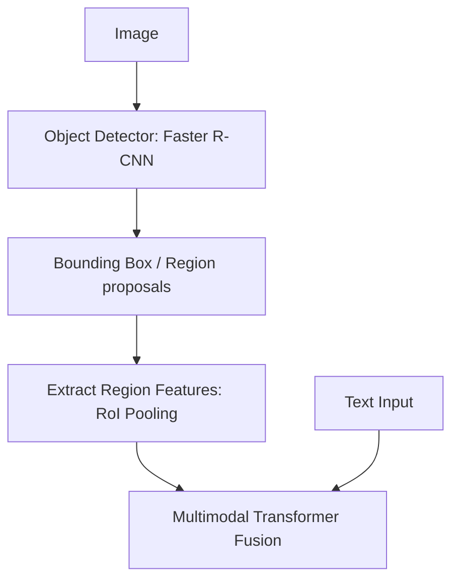

# Region-Based Object Grounding (RoI-Based)

Region-based models extract explicit bounding box features before performing multimodal alignment.

## Architecture & Mechanism
1. An object detector (like Faster R-CNN) detects regions of interest (RoIs) in the image.
2. Feature vectors are extracted for each bounding box region.
3. These region features are sent to the multimodal transformer, enabling grounding of textual references to exact regions.

## Key Models & Papers
* **ViLBERT (Lu et al., 2019):** First dual-stream architecture with co-attentional blocks for region-level grounding. [ViLBERT Paper](https://arxiv.org/abs/1908.02265)
* **Faster R-CNN (Ren et al., 2015):** The foundational object detector used in early VLM pipelines. [Faster R-CNN Paper](https://arxiv.org/abs/1506.01497)

## Advantages
* Excellent spatial precision and object localization.
* Natural grounding of text descriptions to exact coordinates.

## Limitations
* High inference latency due to two-stage extraction.
* Bounded by the class vocabulary of the pre-trained object detector.

[← Back to README](../README.md)
