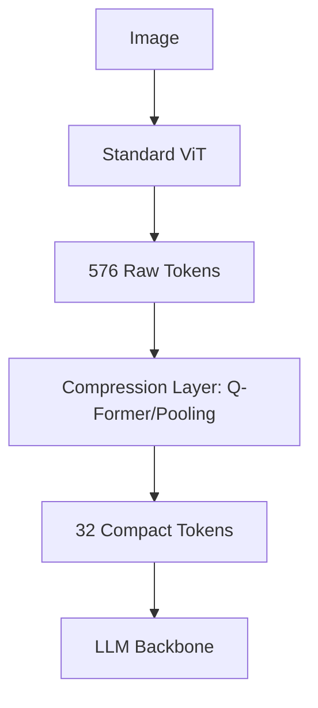

# The Visual Token Explosion Problem

Deploying VLMs requires managing the massive context window footprint of dense visual tokens.

## The Bottleneck
A standard ViT processing a single image can yield 576 or more tokens. In multi-image workflows (like reading a 10-page document), the prompt size exceeds several thousand tokens, saturating KV-cache memory and increasing inference latencies.

## Mitigations
**Token Compression Kernels** compress visual sequences before they reach the main LLM.
* **Q-Former:** Uses learnable query vectors to extract key visual concepts.
* **C-Abstractor (Honeybee):** Uses local pooling layers (resampler kernels) to aggregate neighboring visual tokens.

## Key Models & Papers
* **BLIP-2 (Li et al., 2023):** Showcased Q-Former compression. [BLIP-2 Paper](https://arxiv.org/abs/2301.12597)
* **Honeybee (Cha et al., 2023):** Showcased C-Abstractor design. [Honeybee Paper](https://arxiv.org/abs/2312.06742)

[← Back to README](../README.md)
